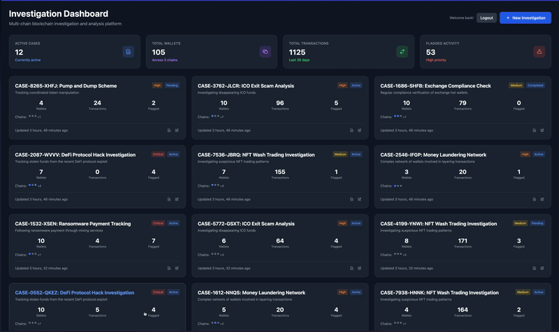

# Multi-Chain Crypto Wallet Investigation Dashboard

A Django application for investigating cryptocurrency wallets across multiple blockchains, built with Django, HTMX, and Django Ninja.



## Features

- Track wallets across Ethereum, Bitcoin, and Solana (mock data)
- Create and manage investigation cases
- View transaction history and portfolio analytics
- Real-time updates via Server-Sent Events
- RESTful API with automatic documentation

## Tech Stack

- **Backend**: Django 4.2, Django Ninja
- **Frontend**: HTMX, Tailwind CSS, Chart.js
- **Database**: SQLite
- **Authentication**: JWT

## Quick Start

```bash
# Install uv (fast Python package manager)
curl -LsSf https://astral.sh/uv/install.sh | sh

# Setup
uv venv .venv
source .venv/bin/activate  # On Windows: .venv\Scripts\activate
uv pip install -r requirements/development.txt
cp .env.example .env

# Initialize database
python manage.py migrate
python manage.py generate_mock_data
python manage.py generate_investigation_data

# Run server
python manage.py runserver
```

## Access Points

- Main app: <http://localhost:8000/>
- API docs: <http://localhost:8000/api/docs/>

## API Endpoints

- `/api/auth/*` - Authentication
- `/api/v1/investigations/*` - Case management
- `/api/v1/wallets/*` - Wallet operations
- `/api/v1/transactions/*` - Transaction data

## Testing

```bash
pytest
python scripts/test_api.py
```

## Notes

This is a demo application using mock blockchain data. Real blockchain integration would require additional API services.

